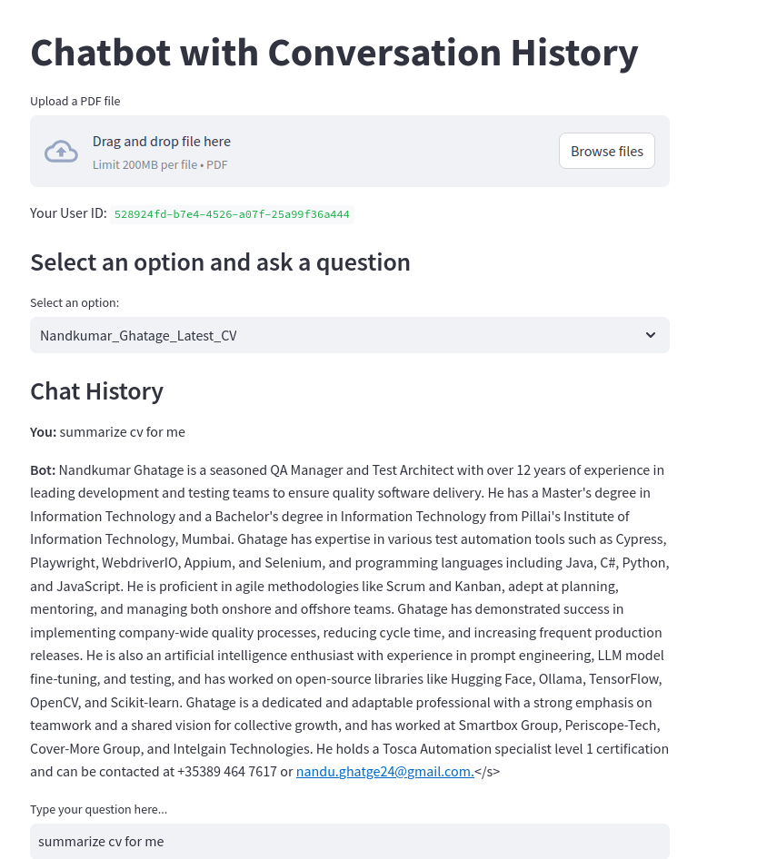

# Rag-AI-Chatbot

Rag-based AI chatbot that allows you to interact with your documents using natural language.

## Setup Instructions

Follow the steps below to set up the project locally:

### 1. **Clone the Repository**

Clone the repository to your local machine:

```bash
git clone https://github.com/nand1234/Rag-AI-Chatbot.git
```

### 2. **Create a Virtual Environment**

Create a virtual environment to isolate your project dependencies:

#### For Windows:
```bash
python -m venv venv
```

#### For macOS/Linux:
```bash
python3 -m venv venv
```

Activate the virtual environment:

#### For Windows:
```bash
venv\Scripts\activate
```

#### For macOS/Linux:
```bash
source venv/bin/activate
```

### 3. **Install Dependencies**

Install the required dependencies using `pip`:

```bash
pip install -r requirements.txt
```

### 4. **Login to Hugging Face**

Make sure you log in to Hugging Face using your API token from the command line.
Upload PDF for chat

```bash
huggingface-cli login
```

Follow the prompts to enter your Hugging Face API token.

### 5. **Install Redis Server**

Make sure you have Redis installed on your local machine. You can install Redis based on your operating system:

- **Windows:** Use [Redis for Windows](https://github.com/tporadowski/redis/releases).
- **macOS:** Install using Homebrew:
  ```bash
  brew install redis
  ```
- **Linux:** Install using apt (for Ubuntu/Debian):
  ```bash
  sudo apt-get install redis-server
  ```

### 6. **Start Redis Server**

Start the Redis server on port 6380:

```bash
redis-server --port 6380
```

Make sure the Redis server is running before starting the application.

### 7. **Start the Application**

Run the chatbot application using Streamlit:

```bash
streamlit run streamlit-bot.py
```

This will start the application, and you can interact with your documents through the web interface.

---

## Troubleshooting

- If you encounter any issues with Redis, check that the server is running on port 6380 and no other processes are using the port.
- Make sure your Hugging Face token is valid and you're properly logged in before interacting with the model.



